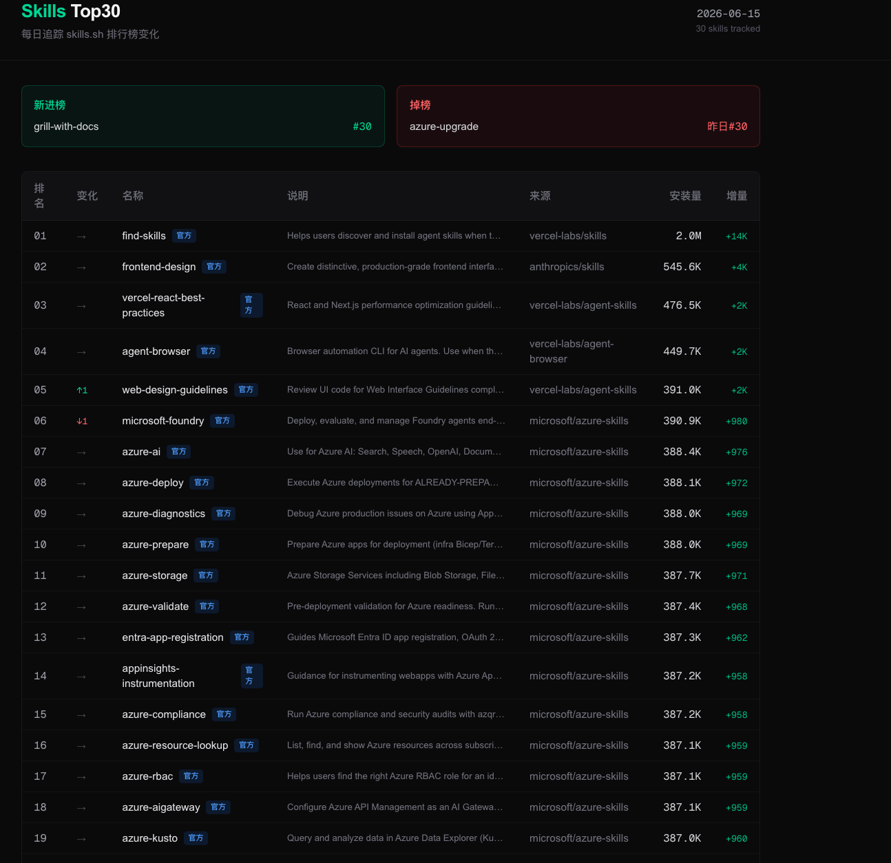

# Skills Leaderboard

> 每日追踪 [skills.sh](https://www.skills.sh/) Top30 排行榜变化 — Python 数据采集 + 自动化报告

🎯 **在线 demo**：https://www.haol.top/apps/skills



## 项目背景

Claude Code skill 生态爆发后，需要追踪哪些 skill 增长最快、新进榜哪些、掉榜哪些。本项目每日自动采集 Top30 数据，生成结构化 JSON 快照和 Markdown 日报，前端独立项目读取 JSON 展示。

## 功能

- 每天自动爬取 skills.sh 排行榜
- 保存 Top30 JSON 快照（含安装量、每周趋势）
- 对比昨天生成 diff（排名变化、新进榜、掉榜）
- 生成 Markdown 日报

## 技术栈

| 层 | 技术 | 说明 |
|----|------|------|
| 数据采集 | Python + requests | 爬取 skills.sh 排行榜 |
| 数据存储 | JSON 文件 | Git 版本控制 + 前端可直接 fetch |
| 自动化 | GitHub Actions | 每天北京时间 10:00 自动运行 |
| 前端展示 | Next.js（独立项目） | 部署在 haol.top，读取本项目 JSON |

## 数据结构

```
data/
├── latest.json           # 最新快照（含 diff）
├── dates.json            # 日期索引
├── snapshots/
│   └── 2026-05-28.json   # 每日快照
└── reports/
    └── 2026-05-28.md     # 每日报告
```

## 本地运行

```bash
pip install -r requirements.txt
python scripts/daily.py
```

指定日期：

```bash
python scripts/daily.py --date 2026-05-28
```

## 自动运行

GitHub Actions 每天北京时间 10:00 自动运行，也可手动触发。

## 数据来源

- 排行榜数据：[skills.sh](https://www.skills.sh/)
